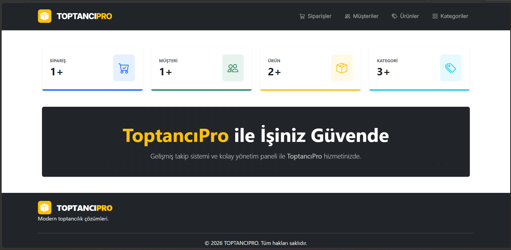
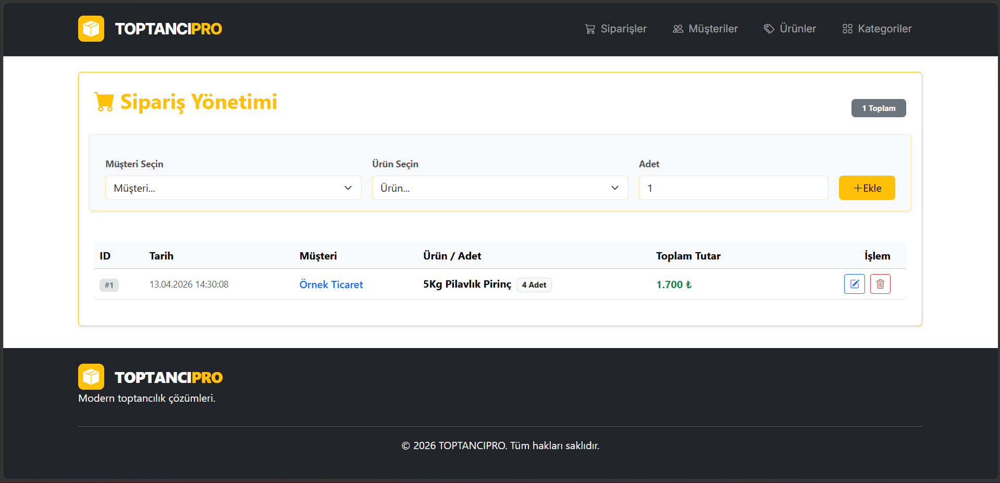
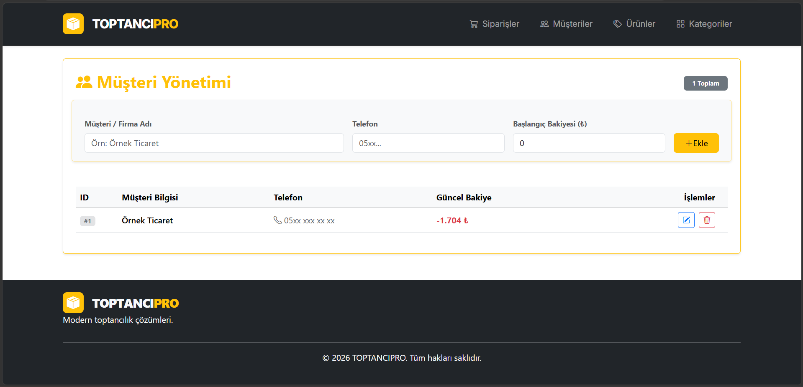
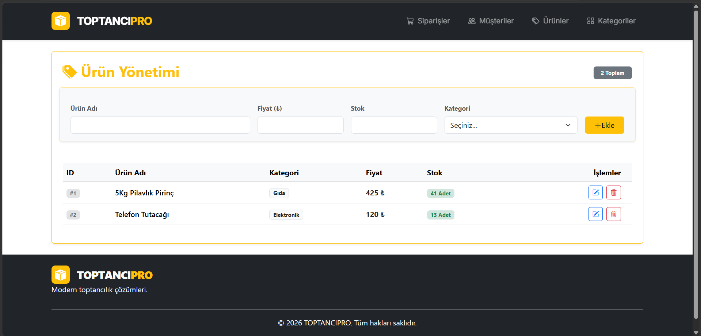
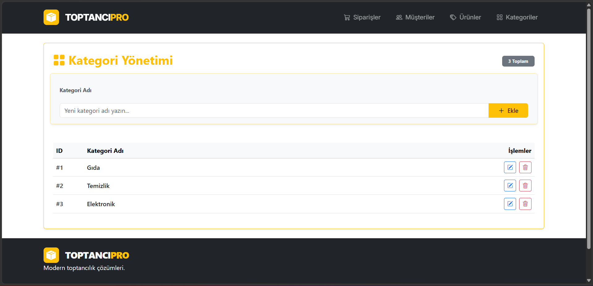

# ToptancıPro - Stok ve Müşteri Yönetim Sistemi

Modern web teknolojileri ile geliştirilmiş, toptancılar için ürün, kategori, müşteri ve sipariş takibi yapabilen kapsamlı bir yönetim paneli uygulamasıdır.

## 🚀 Proje Hakkında

Bu proje, modern JavaScript kütüphaneleri kullanılarak, bütüncül bir uygulama geliştirme deneyimi kazanmak amacıyla hazırlanmıştır. Uygulama, tam işlevsel bir CRUD (Create, Read, Update, Delete) yapısına sahiptir.
🔗 **Canlı Demo:** [https://toptancipro.netlify.app]

## 🛠️ Kullanılan Teknolojiler

- **Framework:** React Router 7 (Vite tabanlı Remix)
- **Tasarım:** Bootstrap 5 & Bootstrap Icons
- **Veri Yönetimi:** LocalStorage (Tarayıcı tabanlı kalıcı veri yönetimi)
- **Mimari:** Modüler Bileşen Yapısı (Components, Routes, Interfaces)

## 📁 Proje Klasör Yapısı

Proje klasörü için aşağıdaki modüler yapı kurgulanmıştır:

- `app/Components`: Navbar, Footer gibi tekrar eden arayüz elemanları.
- `app/routes`: Sayfa bileşenleri ve yönlendirmeler.
- `app/Interfaces`: Veritabanı (db.js) ve veri iletişim katmanı.
- `screenshots`: Proje görüntüleri.

## ✨ Temel Özellikler (CRUD)

- **Ürün Yönetimi:** Stok takibi ve fiyatlandırma.
- **Müşteri Yönetimi:** Müşteri kayıtları ve bakiye takibi.
- **Sipariş Sistemi:** Ürün satışı yapıldığında otomatik stok düşümü ve müşteri bakiyesi güncelleme.
- **Kategori Yönetimi:** Ürünlerin kategorize edilmesi.

## 💻 Kurulum ve Çalıştırma

Projeyi yerel bilgisayarınızda çalıştırmak için:

1. Projeyi bilgisayarınıza indirin.
2. Terminali açın ve `npm install` komutu ile bağımlılıkları yükleyin.
3. `npm run dev` komutu ile projeyi ayağa kaldırın.

## 📸 Proje Ekran Görüntüleri

<table style="width: 100%;">
  <tr>
    <td colspan="2" style="text-align: center;"></td>
  </tr>
  <tr>
    <td style="width: 50%;"></td>
    <td style="width: 50%;"></td>
  </tr>
  <tr>
    <td style="width: 50%;"></td>
    <td style="width: 50%;"></td>
  </tr>
</table>
